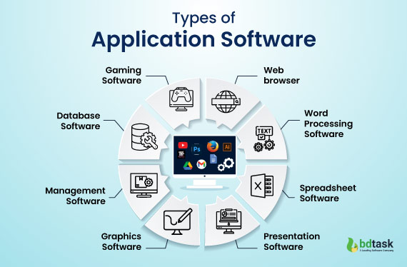

# what  is application software ?

Application software is a type of computer program designed to help end-users perform specific tasks, such as creating documents, browsing the internet, or editing images.

Application software is just the technical term for an "app." It is a program designed to help you, the user, do one specific type of task.

**Example**

1. Web Browsers:  Google Chrome, Mozilla Firefox, Safari.
2. Productivity Tools:  Microsoft, Google Workspace, Adobe Photoshop.
3. Mobile Apps:  WhatsApp, Instagram.
4. Multimedia:  VLC Media Player.
5. Creative & AI Tools:  Gemini, notebooklm, cloude.

 