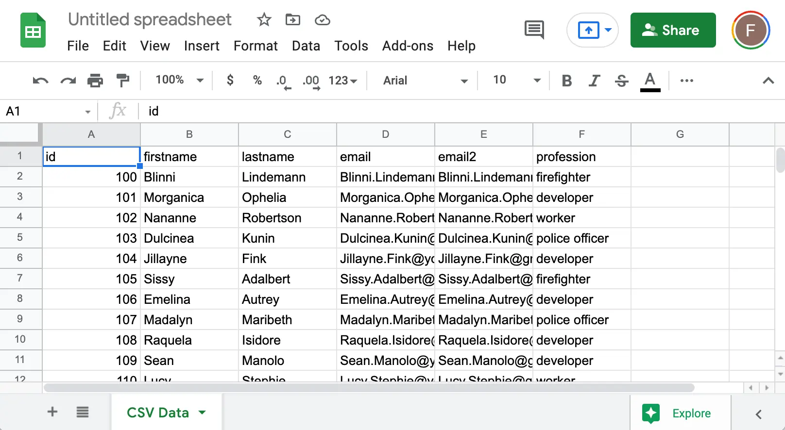

# what is CSV?

CSV = Comma-sepe=areted values
It is a plain text file formate used to store tabuler data in a structured format.

**Uses**
Exporting contacts from email systems.
Moving data between customer relationship management (CRM) systems.
Storing data for machine learning or data analysis.

**Example**
Name,Age,Department
John,30,Sales
Jane,25,Engineering

