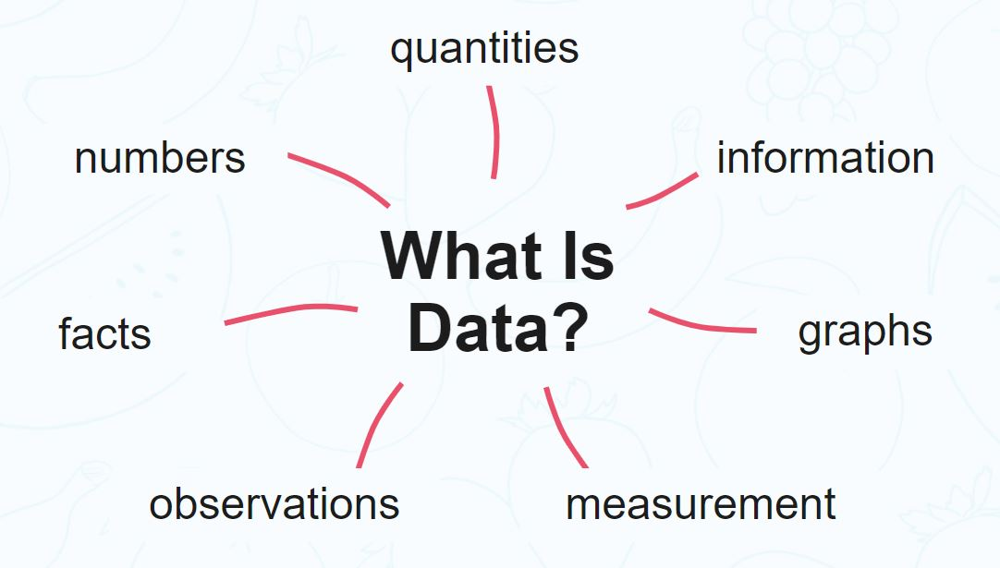

# what is data ?

  1. data is a collection of informations and collection of instruction 
  2. data is basically three types

    **types of data**

    1. structured data
    2. unstructured data
    3.  raw data

    **structured data**

    1. structured data is in instruction in form of structured 

      ```
       excel
       csv
       tables
      ```   

    **unstructured data**

    1. unstrcutred data is in instruction in form of unstructured formate

      ```
      text
      image
      file
      audio
      video

      ```  
   
    **raw data**

    1. raw data  is in instruction in form of api or raw i.e in form of raw formate

      ```
      json data
      object
      
      ```  
      
