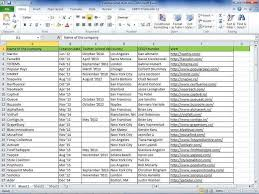

# what is excel?

Microsoft Excel is a widely used spreadsheet application developed by Microsoft that organizes, analyzes, and visualizes data using rows and columns. It is a core component of the Microsoft 365 suite, providing tools for calculations, graphing, pivot tables, and data management on Windows, macOS, Android, and iOS.

1. Purpose: Used for data entry, accounting, financial modeling, and data 2' 2.2.2.2. organization.Structure: Uses a grid-based system where data is organized into rows and columns, creating cells.
3. Functionality: Enables mathematical operations, formulas, functions, and data visualization tools like charts and sparklines.

**Example**
1. Budgets: Tracking monthly income vs. expenses.
2. Inventories: Managing stock levels.
3. Invoices: Generating itemized bills for clients.
4. Timesheets: Recording employee working hours.

