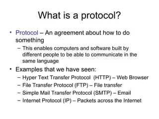

# what is protocol?

A protocol is a standardized set of rules, procedures, or conventions that govern how data is transmitted, systems operate, or people act, ensuring consistency and understanding

**Uses**

Networking: In computer science, protocols (e.g., HTTP, IP) are sets of rules for formatting and processing data, allowing computers to communicate properly.
Medical/Scientific: A detailed plan for an experiment, medical treatment, or study procedure, detailing how it will be done, by whom, and what information will be gathered.
Diplomatic/Social: A strict code of behavior or etiquette for officials, diplomats, or specific professional situations.

**Example**

1. TCP/IP (Transmission Control Protocol/Internet Protocol): The fundamental rules for data transmission on the internet, which breaks data into packets and ensures they reach the correct destination.
2. HTTPS (Secure HyperText Transfer Protocol): An extension of HTTP that uses encryption for secure communication, commonly used for online banking and shopping.
3. FTP (File Transfer Protocol): A standard protocol used to transfer computer files from a server to a client on a network.
4. SMTP (Simple Mail Transfer Protocol): A standard protocol for sending emails across networks.
5. DNS (Domain Name System): A protocol that translates human-readable domain names (e.g., google.com) into computer-readable IP addresses.
6. Ethernet/802.11: Rules governing wired (Ethernet) and wireless (Wi-Fi) communication at the hardware level.

