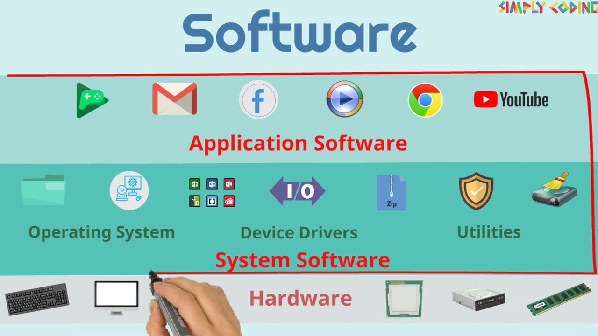

# what is software?

Software is a collection of instructions, data, or programs used to operate computers and execute specific tasks. As the intangible component of a computer system, it acts as the bridge between human needs and hardware capabilities, directing physical components on how to perform tasks.

**Categories of Software:**

1. System Software: Designed to run a computer's hardware and provide a platform for applications (e.g., operating systems like Windows, macOS, Linux, and firmware).
2. Application Software: Allows users to perform specific tasks (e.g., web browsers, MS Office, games, mobile apps).
3. Development Tools: Software that supports the creation, testing, and debugging of other applications (e.g., compilers, IDEs).

**Example**
1. Word Processors: Microsoft Word, Google Docs.
2. Web Browsers: Google Chrome, Mozilla Firefox, Safari.
3. Operating Systems: Windows 10/11, macOS, Linux, Android, iOS.
4. Device Drivers: Software that enables hardware components (printers, graphics cards) to communicate with the OS.
5. Streaming/Paid Services: Netflix, YouTube TV, Spotify.

