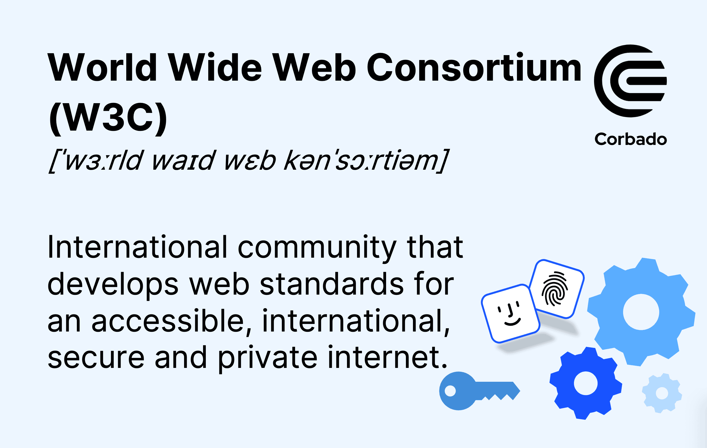

# what is w3c?

The World Wide Web Consortium (W3C) is the primary international standards organization for the World Wide Web. Its central mission is to lead the Web to its full potential by developing open standards, protocols, and guidelines that ensure its long-term growth, interoperability, and accessibility for all.

Purpose: The W3C leads the Web to its full potential by developing protocols and guidelines, including a strong focus on accessibility, internationalization, privacy, and security.

 **Examples of W3C Standards**
 1. HTML (HyperText Markup Language): The standard markup language used to structure a web page's content, such as defining headings, paragraphs, and links.
 2. CSS (Cascading Style Sheets): The standard for styling web pages, allowing developers to control layouts, colors, and fonts.
 3. WebRTC (Web Real-Time Communications): The technology that enables real-time voice and video communication directly in browsers, used for tools like video meetings and online gaming.
 4. WCAG (Web Content Accessibility Guidelines): A set of international standards designed to make web content more accessible to people with disabilities.

 