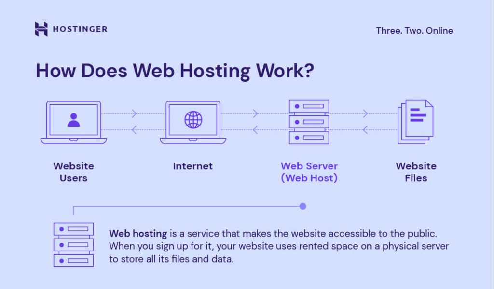

# what is web hosting?

Web hosting is a service that stores a website's files (code, images, videos) on a secure, specialized computer called a server, making them accessible to users on the internet 24/7. A hosting provider manages this server, ensuring the site is secure, fast, and connected to the internet. Without it, your site cannot go live.

**type of web hosting**

1. Shared Hosting: Multiple websites live on one server, sharing resources. It is cost-effective and ideal for beginners.
2. Virtual Private Server (VPS) Hosting: A hybrid approach where a server is partitioned into virtual units, offering more control and stability than shared hosting.
3. Dedicated Hosting: An entire server is rented for one website, offering maximum performance and security.
4. Cloud Hosting: Distributes your site across multiple servers to maximize uptime and scalability.
5. Managed WordPress Hosting: A specialized, optimized, and managed service specifically for WordPress sites

**Example**
1. Shared Hosting (Beginner): Best for small blogs or new websites, where many sites share one server (e.g., Bluehost, HostGator).
2. Cloud Hosting (Flexible): Uses a network of servers for high reliability (e.g., AWS, Google Cloud, Wix).
3. Dedicated Hosting (Enterprise): A private server for high-traffic websites.
4. Static Hosting (Developers): Ideal for portfolios (e.g., GitHub Pages).
5. VPS Hosting (Advanced): Provides dedicated virtual resources for better performance.

