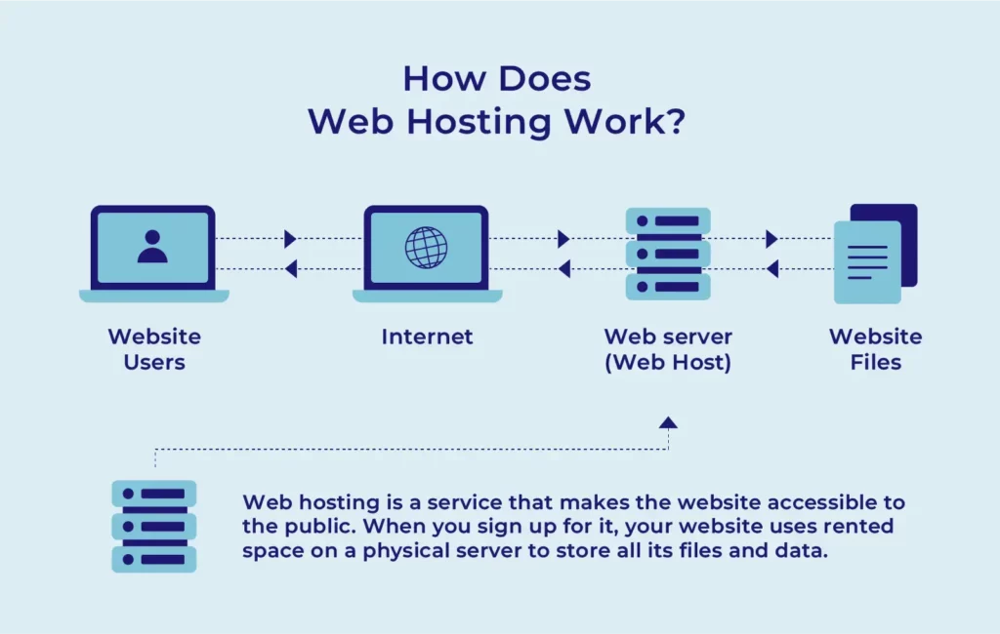

# what is web server?

A web server is a computer system (hardware) and software that stores, processes, and delivers website content—such as HTML, images, and videos—to users over the internet. It primarily uses HTTP (Hypertext Transfer Protocol) or its secure version (HTTPS) to respond to requests from web browsers.

**How it Works:**
 When a browser (client) requests a page, the web server finds the file, processes it if necessary, and sends it back. If it cannot find it, it returns a 404 error.

 **Example**

1. Apache HTTP Server: One of the most popular open-source web servers globally, known for its flexibility and high customizability.
2. Nginx (pronounced "Engine-X"): A high-performance server favored for its speed and efficiency in handling many simultaneous connections.
3. Microsoft IIS (Internet Information Services): A server developed specifically for Windows-based environments and Microsoft technologies.
4. LiteSpeed: A commercial web server designed for high speed and security.

